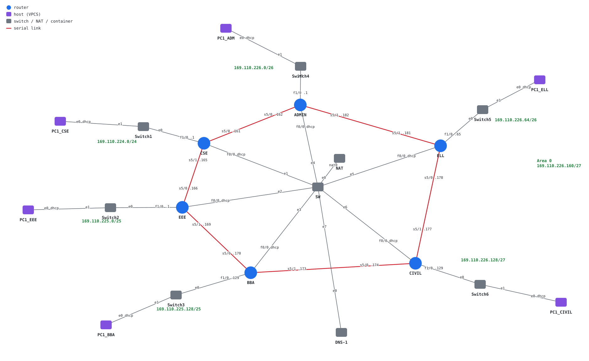

# Campus Network with NAT & DHCP (GNS3)

[](https://github.com/salehinafnan/campus-network-gns3/actions/workflows/labcheck.yml)

This is the final project (Project 3) for the Computer Networks Lab (CSE-3634)
at IIUC, 2022. It extends the
[OSPF campus network](https://github.com/salehinafnan/campus-network-ospf)
from Project 2 in three ways:

- **Internet access through NAT.** Every department router has an uplink to
  the GNS3 NAT node and translates its LAN's traffic with PAT (`overload`).
- **DHCP for hosts.** Each router hands out addresses, the gateway and DNS
  to its own department.
- **OSPF between departments**, over a ring of six serial links with one
  `/30` per link.



> **About the router configs**
>
> The original submission only committed the topology (`.gns3`), not the
> router configurations. As a result, the project opened with blank routers.
> The configs now in `gns3/project-files/` are a **reference implementation
> written in 2026**. They implement the
> [project proposal](docs/Project%203%20proposal%20-%20NAT.pdf) on this exact
> topology. They pass the static checks in `tools/labcheck.py`, but they
> haven't been booted on IOS since being written.

## Design

### Addressing

The department LANs use the same VLSM plan as Project 2, carved from
`169.110.224.0/21`.

| Department     | LAN                  | Router (gateway)  | Hosts get           |
| -------------- | -------------------- | ----------------- | ------------------- |
| CSE            | `169.110.224.0/24`   | CSE `f1/0` .1     | DHCP pool `CSE_LAN` |
| EEE            | `169.110.225.0/25`   | EEE `f1/0` .1     | DHCP                |
| BBA            | `169.110.225.128/25` | BBA `f1/0` .129   | DHCP                |
| Administrative | `169.110.226.0/26`   | ADMIN `f1/0` .1   | DHCP                |
| ELL            | `169.110.226.64/26`  | ELL `f1/0` .65    | DHCP                |
| Civil          | `169.110.226.128/27` | CIVIL `f1/0` .129 | DHCP                |

The backbone ring uses `169.110.226.160/27`, with one `/30` per serial link:

| Link                  | Subnet               | Addresses            |
| --------------------- | -------------------- | -------------------- |
| CSE s5/0 ↔ ADMIN s5/0 | `169.110.226.160/30` | CSE .161, ADMIN .162 |
| CSE s5/1 ↔ EEE s5/0   | `169.110.226.164/30` | CSE .165, EEE .166   |
| EEE s5/1 ↔ BBA s5/0   | `169.110.226.168/30` | EEE .169, BBA .170   |
| BBA s5/1 ↔ CIVIL s5/0 | `169.110.226.172/30` | BBA .173, CIVIL .174 |
| CIVIL s5/1 ↔ ELL s5/0 | `169.110.226.176/30` | CIVIL .177, ELL .178 |
| ELL s5/1 ↔ ADMIN s5/1 | `169.110.226.180/30` | ELL .181, ADMIN .182 |

The uplink on each router's `f0/0` runs through switch `SW` to the GNS3 NAT
node. The router gets its address and a default route from the NAT node over
DHCP.

### How traffic flows

- **Department to department:** routed by OSPF over the ring. A ring
  survives the loss of any one link. The LAN interfaces are passive, so no
  OSPF hellos go out to hosts.
- **Department to internet:** each router sends it out of its _own_ uplink.
  The DHCP-learned default route has administrative distance 254, and OSPF
  never carries it. NAT translates only traffic that leaves through
  `f0/0` (`ip nat outside`). Traffic between departments keeps its real
  addresses.

The reference config for one router (CSE) looks like this. The other five
follow the same pattern.

```
ip dhcp excluded-address 169.110.224.1
ip dhcp pool CSE_LAN
 network 169.110.224.0 255.255.255.0
 default-router 169.110.224.1
 dns-server 8.8.8.8 1.1.1.1
!
interface FastEthernet0/0
 description Uplink to GNS3 NAT node (address + default route via DHCP)
 ip address dhcp
 ip nat outside
!
interface FastEthernet1/0
 description CSE LAN
 ip address 169.110.224.1 255.255.255.0
 ip nat inside
!
interface Serial5/0
 description Link to ADMIN Serial5/0
 ip address 169.110.226.161 255.255.255.252
!
interface Serial5/1
 description Link to EEE Serial5/0
 ip address 169.110.226.165 255.255.255.252
!
router ospf 1
 router-id 1.1.1.1
 passive-interface FastEthernet1/0
 network 169.110.224.0 0.0.0.255 area 0
 network 169.110.226.160 0.0.0.3 area 0
 network 169.110.226.164 0.0.0.3 area 0
!
access-list 1 permit 169.110.224.0 0.0.0.255
ip nat inside source list 1 interface FastEthernet0/0 overload
```

Full configs, loaded automatically by GNS3:

| Router | Startup config                                                                                                            |
| ------ | ------------------------------------------------------------------------------------------------------------------------- |
| CSE    | [`i1_startup-config.cfg`](gns3/project-files/dynamips/e042ea43-25f6-4f87-928d-13126f22fec7/configs/i1_startup-config.cfg) |
| EEE    | [`i2_startup-config.cfg`](gns3/project-files/dynamips/9e808cc9-9ae3-42f8-875d-410e97aa9479/configs/i2_startup-config.cfg) |
| BBA    | [`i3_startup-config.cfg`](gns3/project-files/dynamips/fbb8015a-0946-41bd-9dba-9b85125a25de/configs/i3_startup-config.cfg) |
| ADMIN  | [`i4_startup-config.cfg`](gns3/project-files/dynamips/be203a76-449a-4c6c-b64d-8625c60d840c/configs/i4_startup-config.cfg) |
| ELL    | [`i5_startup-config.cfg`](gns3/project-files/dynamips/72042174-92ce-499d-9470-b5f28f6a1965/configs/i5_startup-config.cfg) |
| CIVIL  | [`i6_startup-config.cfg`](gns3/project-files/dynamips/146b559b-4366-47bd-8e90-cd2fb9e22bdf/configs/i6_startup-config.cfg) |

Each PC's `startup.vpc` runs `ip dhcp`.

## Running the lab

1. Install **GNS3 2.2.x** with the **GNS3 VM**. The project was saved with
   2.2.31, and every node runs on the VM, which also provides the NAT node.
2. Add a Cisco 7200 template that uses `c7200-advipservicesk9-mz.152-4.S5.image`
   (MD5 `cbbbea66a253f1dac0fcf81274dc778d`). The image is licensed, so it
   isn't included here.
3. Open `gns3/0to255_P3.gns3` and start all nodes.
4. Verify:

   ```
   CSE# show ip ospf neighbor           ! two FULL neighbours per router
   CSE# show ip route                   ! S* default via DHCP, O routes to the other LANs
   CSE# show ip dhcp binding            ! PC1_CSE's lease
   PC1_CSE> show ip                     ! address from the CSE_LAN pool
   PC1_CSE> ping 169.110.226.130        ! Civil host, across the ring
   PC1_CSE> ping 8.8.8.8                ! out through NAT, the proposal's success test
   CSE# show ip nat translations
   ```

The topology also contains a DNS container, **DNS-1** (`adosztal/dns`), on
the uplink switch. Its configuration was never saved with the project, so the
DHCP pools point hosts at public resolvers instead.

## Lab linter

`tools/labcheck.py` is a standard-library Python script. It parses the
topology together with every router and PC config, and checks:

- link and segment addressing
- duplicate IPs
- OSPF coverage, areas, passive interfaces and wildcard width
- host gateways and DHCP pools
- NAT inside, outside and ACL consistency

It can also print the addressing plan and render the diagram above.

```bash
python3 tools/labcheck.py gns3/0to255_P3.gns3                    # 0 errors, 0 warnings
python3 tools/labcheck.py gns3/0to255_P3.gns3 --table            # addressing plan
python3 tools/labcheck.py gns3/0to255_P3.gns3 --svg docs/topology.svg
python3 -m unittest discover tools
```

GitHub Actions runs the linter and its tests on every push.

## Team

**Team 0to255:** Mushfiqus Salehin Afnan, Mahir Shadid, Md. Abul
Bashar, Mahafujul Alam and Pritom Saha. Supervised by Abdullahil Kafi, Dept.
of CSE, IIUC.
